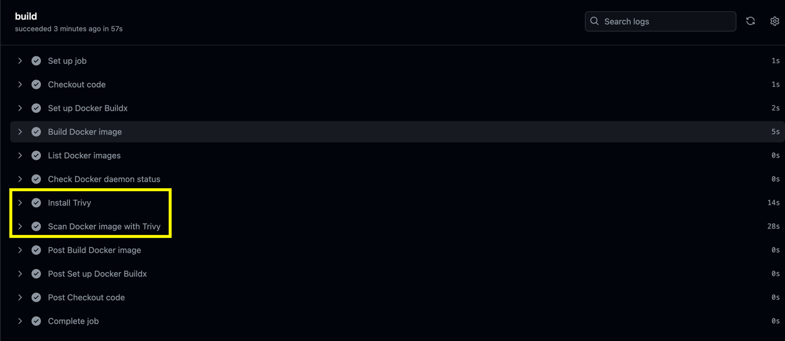

# Container Image CVE Scanning
The purpose of this project is to demonstrate CVE Scanning tooling in action and how it can be benefial to 
organizations.

## Steps:
1. Build a dockerfile and container image using docker.
2. Leverage an open-source CVE scanning tool to determine if there are any exploitable vulnerabilities 
in our container image.
3. Fix injected, identified CVE's (libssl-dev).
4. Re-scan to visualize the correction and security improvement.
5. BONUS: Build a simple pipeline with GitHub Actions

### Tooling & Binaries
* [Trivy](https://github.com/aquasecurity/trivy): Trivy is the chosen open-source CVE scanning tool for this 
demonstration, an Aqua Security project. Trivy is defined as a simple and comprehensive vulnerability scanner for 
containers. It supports scanning images stored in various container registries, including Docker Hub and private 
registries. Trivy is easy to use and integrates well with CI/CD pipelines.
* Docker
* Git

#### Versions
```
trivy --version && \
docker --version && \
git --version
  Version: 0.52.0
  Docker version 20.10.12, build e91ed57
  git version 2.39.2
```

#### Building
1. Build docker image
```
docker build -t cve-image:demo .
```
2. Scan the image for CVEs (find the CVE specific to the library we installed)
```
trivy image cve-image:demo

cve-image:demo (debian 12.5)

Total: 92 (UNKNOWN: 0, LOW: 59, MEDIUM: 27, HIGH: 5, CRITICAL: 1)

├────────────────────┼─────────────────────┼──────────┼──────────────┼───────────────────────┼───────────────┼──────────────────────────────────────────────────────────────┤
| libssl-dev         │ CVE-2023-5678       │ MEDIUM   │              │ 3.0.11-1~deb12u2      │               │ openssl: Generating excessively long X9.42 DH keys or        │
│                    │                     │          │              │                       │               │ checking excessively long X9.42...                           │
│                    │                     │          │              │                       │               │ https://avd.aquasec.com/nvd/cve-2023-5678                    │
│                    ├─────────────────────┤          │              │                       ├───────────────┼──────────────────────────────────────────────────────────────┤
│                    │ CVE-2023-6129       │          │              │                       │               │ mysql: openssl: POLY1305 MAC implementation corrupts vector  │
│                    │                     │          │              │                       │               │ registers on PowerPC                                         │
│                    │                     │          │              │                       │               │ https://avd.aquasec.com/nvd/cve-2023-6129                    │
│                    ├─────────────────────┤          │              │                       ├───────────────┼──────────────────────────────────────────────────────────────┤
│                    │ CVE-2023-6237       │          │              │                       │               │ openssl: Excessive time spent checking invalid RSA public    │
│                    │                     │          │              │                       │               │ keys                                                         │
│                    │                     │          │              │                       │               │ https://avd.aquasec.com/nvd/cve-2023-6237                    │
│                    ├─────────────────────┤          │              │                       ├───────────────┼──────────────────────────────────────────────────────────────┤
│                    │ CVE-2024-0727       │          │              │                       │               │ openssl: denial of service via null dereference              │
│                    │                     │          │              │                       │               │ https://avd.aquasec.com/nvd/cve-2024-0727                    │
│                    ├─────────────────────┤          ├──────────────┤                       ├───────────────┼──────────────────────────────────────────────────────────────┤
│                    │ CVE-2024-4603       │          │ fix_deferred │                       │               │ openssl: Excessive time spent checking DSA keys and          │
│                    │                     │          │              │                       │               │ parameters                                                   │
│                    │                     │          │              │                       │               │ https://avd.aquasec.com/nvd/cve-2024-4603                    │
│                    ├─────────────────────┤          │              │                       ├───────────────┼──────────────────────────────────────────────────────────────┤
│                    │ CVE-2024-4741       │          │              │                       │               │ openssl: Use After Free with SSL_free_buffers                │
│                    │                     │          │              │                       │               │ https://avd.aquasec.com/nvd/cve-2024-4741                    │
│                    ├─────────────────────┼──────────┤              │                       ├───────────────┼──────────────────────────────────────────────────────────────┤
│                    │ CVE-2024-2511       │ LOW      │              │                       │               │ openssl: Unbounded memory growth with session handling in    │
│                    │                     │          │              │                       │               │ TLSv1.3                                                      │
│                    │                     │          │              │                       │               │ https://avd.aquasec.com/nvd/cve-2024-2511                    |
├────────────────────┼─────────────────────┼──────────┼──────────────┼───────────────────────┼───────────────┼──────────────────────────────────────────────────────────────┤
```
3. Remove `libssl-dev`, the library we installed onto our docker image with known CVEs.
4. Build the fixed docker image
```
docker build -t cve-image-fixed:demo .
```
5. Scan the new image for CVEs
```
trivy image cve-image-fixed:demo

cve-image-fixed:demo (debian 12.5)

Total: 78 (UNKNOWN: 0, LOW: 57, MEDIUM: 15, HIGH: 5, CRITICAL: 1)
```
NOTE: Considerably less identified CVEs in this new image.

#### GitHub Actions
1. mkdir for `.github/workflows`
2. touch file for `github-actions.yaml`
3. Create your actions
4. Push to repository


